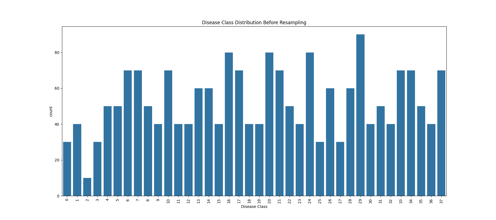
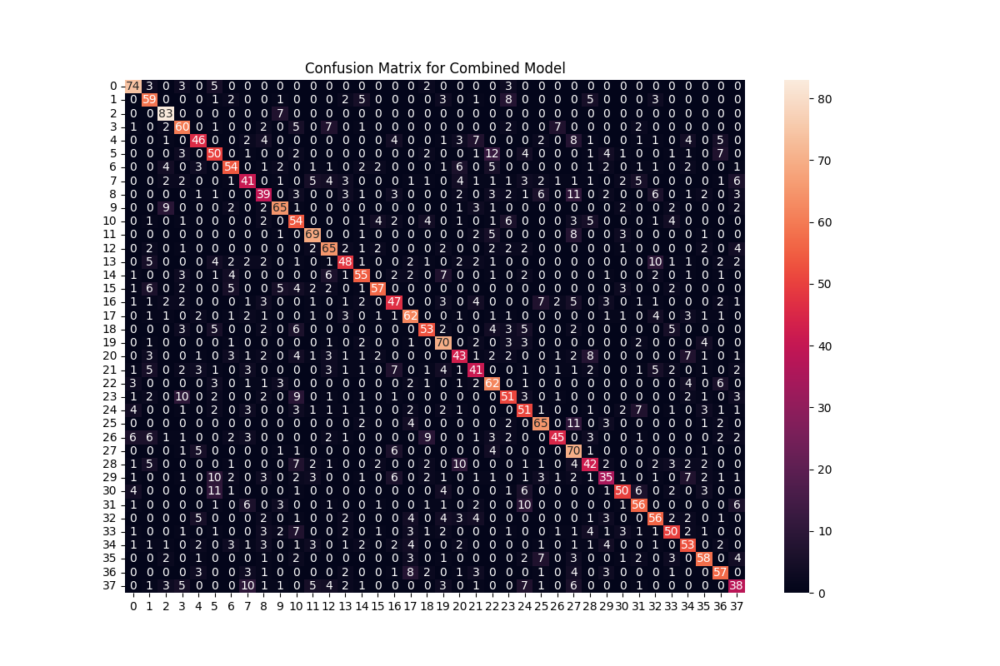

# 🧠 Disease Prediction using Machine Learning

This project is focused on predicting diseases based on a variety of symptoms using machine learning algorithms. It incorporates data preprocessing, resampling to handle class imbalance, model training with cross-validation, and ensemble prediction techniques. Visualizations are also generated to better understand class distribution and model performance.

---

## 📂 Project Structure

```
DISEASEPREDICTION/
│
├── dataset/
│   └── improved_disease_dataset.csv
│
├── visualize/
│   ├── distribution_disease.png
│   ├── disease_class_distribution_before_resampling.png
│   ├── histogram_<symptom>.png
│   ├── confusion_matrix_svm.png
│   ├── confusion_matrix_nb.png
│   ├── confusion_matrix_rf.png
│   └── confusion_matrix_combined.png
│
├── main.py          # Main script for preprocessing, training, and evaluation
├── test.py          # (Optional) Testing and validation script
└── README.md
```

---

## 📊 Dataset

- **File**: `improved_disease_dataset.csv`
- Each row represents a patient's symptoms and their diagnosed disease.
- Final target: `disease` column (categorical).
- Symptoms include: `cough`, `fatigue`, `fever`, `headache`, `vomiting`, `skin_rash`, `weight_loss`, etc.

---

## 🔍 Workflow Summary

### ✅ Data Preprocessing
- Removed duplicates
- Label encoded the target variable
- Handled missing values by replacing with 0

### 📈 Visualizations
- Symptom-wise histogram plots
- Disease class distribution before resampling
- Confusion matrices for all classifiers

### ⚖️ Handling Class Imbalance
- Used **RandomOverSampler** from `imblearn` to balance the dataset.

### 🧠 Models Used
- **Support Vector Machine (SVM)**
- **Gaussian Naive Bayes**
- **Random Forest**
- Evaluation done using **Stratified K-Fold Cross-Validation**.

### 🤝 Ensemble Prediction
- Combined predictions using `mode` voting.
- Improved overall robustness of model predictions.

---

## 📊 Results

| Model           | Accuracy (%) |
|----------------|--------------|
| SVM            | ~XX.XX       |
| Naive Bayes    | ~XX.XX       |
| Random Forest  | ~XX.XX       |
| **Combined**   | **60.64**    |

> *The combined model uses majority voting to reduce variance and improve generalizability.*

---

## 🖼️ Sample Visualizations

- Disease Class Distribution  
  

- Confusion Matrix for Combined Model  
  

---

## 🛠 Requirements

Install required libraries using:

```bash
pip install -r requirements.txt
```

**`requirements.txt`** (example):

```
pandas
numpy
matplotlib
seaborn
scikit-learn
imbalanced-learn
```

---

## 🚀 Run the Project

```bash
python main.py
```

> Visualizations and confusion matrices will be saved in the `visualize/` folder.

---

## 📌 Future Improvements

- Hyperparameter tuning using GridSearchCV
- Add more ensemble methods like XGBoost or VotingClassifier
- Interactive Streamlit/Gradio web interface for prediction

---

## 📬 Contact

For questions or suggestions, feel free to reach out via [GitHub](https://github.com/yourusername) or LinkedIn.

---
